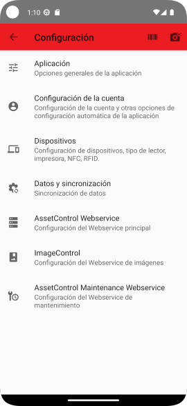

# Filtrado general de rutas

## Descripción

En ocasiones es necesario que los operarios vean y puedan operar sobre determinadas rutas del entorno pero no sobre
otras. Para ello podemos definir una o varias cadenas de texto que deben estar contenidas en la descripción de las rutas
que queremos sean visibles.

## Pasos

|                                                  | Ir a la configuración de la aplicación tocando los 3 puntos en la esquina superior derecha de la pantalla. | 
|-----------------------------------------------------------------------|------------------------------------------------------------------------------------------------------------|
|                          | Seleccionar `Configuración` en el menú emergente.                                                          |
|                              | A continuación deberá ingresar la contraseña de acceso a la configuración.                                 |
|                                | Tocar en la opción que dice `Aplicación`.                                                                  |
|    | Tocar en `Filtrar rutas por descripción`                                                                   |
|                | Se pueden definir múltiples cadenas separadas por punto y coma (;)                                         |
|  | Los filtros activos aparecen ahora en el texto de la configuración                                         |