# Guía de instalación y configuración inicial Milestone 13

## Descarga del instalador

Los instaladores para la plataforma Android se encuentran en la siguiente URL:
[http://resources.dacosys.com/?dir=Asset_Control/Milestone13/installers/android](http://resources.dacosys.com/?dir=Asset_Control/Milestone13/installers/android)

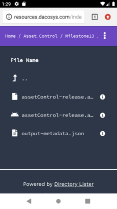

Para acceder a esta dirección debe utilizar las credenciales de cliente que le haya
suministrado Dacosys. Si no dispone de una cuenta o no la recuerda comuníquese con
Dacosys. El archivo a descargar es el APK: [assetControl-release.apk]()

Link de descarga

El proceso de instalación puede solicitarle diferentes permisos que debe otorgar para
descargar el instalador e instalarlo correctamente:

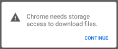
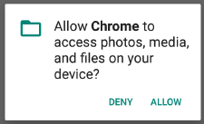

Con los permisos necesarios descargar el archivo:

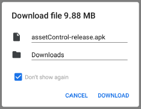

Los archivos APK son instaladores y en algunos casos Android advierte al usuario de
los peligros de instalar software de procedencia desconocida en cuyo caso debe
aceptar esta procedencia de software como confiable para poder continuar:

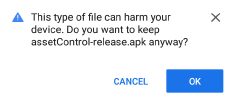
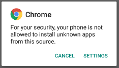
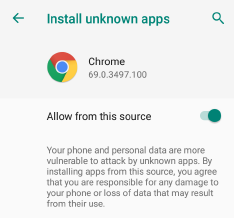

## Instalación de la app

Una vez descargado el archivo, hacer clic en OPEN para iniciar la instalación:

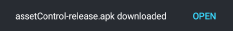

Proceder con la instalación. La aplicación en sí no requiere de permisos especiales:

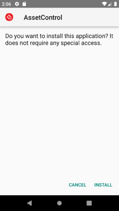

## Primera ejecución y configuración

Hacer doble clic en el ícono del programa.

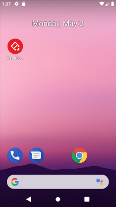

## Configurar cuenta del cliente:

En esta primera ejecución el programa no está configurado y mostrará una pantalla
como la siguiente. Si el programa ya tiene una configuración anterior este paso se salta
y accede directamente a la pantalla de ingreso.

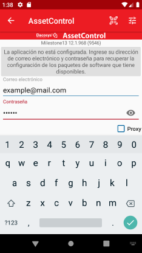

En esta pantalla debe ingresar las credenciales de cliente de Dacosys que son las
mismas que utilizó para descargar el instalador.
Si dispone de un código QR de configuración, puede escanearlo haciendo clic en
y dándole los permisos requeridos a la aplicación si los solicita:

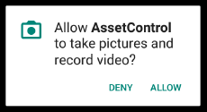

## Selección del ambiente

El configurador le devolverá una lista de los paquetes y ambientes que el cliente tiene
pre-configurados en caso de que posea más de un ambiente. En caso contrario se
configurará automáticamente:

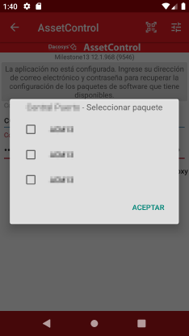

En esta pantalla debe seleccionar el ambiente y los paquetes de software que desea
utilizar en su instalación. Posteriormente, puede elegir otros para cambiar de ambiente.
Una vez seleccionado, hacer clic en Aceptar y se configurarán automáticamente las
conexiones al servidor del ambiente seleccionado.

## Pantalla de ingreso

A continuación el programa le mostrará la pantalla de ingreso donde podrá ingresar su
usuario y contraseña. También puede escanear un código QR de acceso utilizando el
escáner del dispositivo (si cuenta con uno) o por medio de la cámara fotográfica del
dispositivo haciendo clic en: .

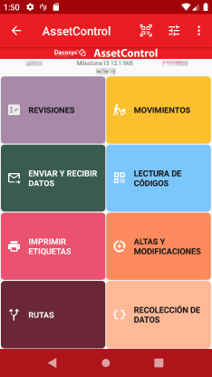

## Sincronización inicial

En el momento de iniciar el programa, se realizará una sincronización de los últimos
cambios realizados en la base de datos si existe una conexión disponible. En caso de
no poseer conexión al servidor se iniciará la aplicación en modo desconectado.

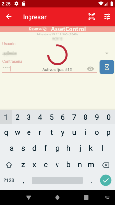

## Pantalla principal

El programa está listo para usarse. En la barra superior aparece el nombre del usuario
actual, la versión de compilación del programa y el ambiente que está configurado.

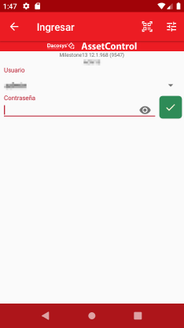