# Guía de instalación y configuración inicial.

**Dacosys AssetControl Milestone13 Windows**

## Descarga del instalador

Los instaladores para cada plataforma (Windows, WHE, Android) se encuentran en la
siguiente URL:

[http://resources.dacosys.com/index.php?dir=Asset_Control/Milestone13/installers](http://resources.dacosys.com/index.php?dir=Asset_Control/Milestone13/installers)

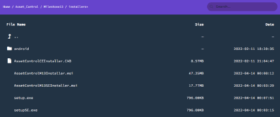

Para acceder a esta dirección debe utilizar las credenciales de cliente que le haya
suministrado Dacosys. Si no dispone de una cuenta o no la recuerda comuníquese con
Dacosys.

**Importante:**
Si el webservice se encuentra alojado en los servidores de Dacosys (dacosys.com), el
archivo a descargar es *AssetControlM13SEInstaller.msi*, con un tamaño de alrededor de
17 MB. En cambio, si se encuentra alojado en servidores propios el archivo a descargar
es *AssetControlM13Installer.msi* con un tamaño aproximado de 47 MB.

## Instalación del software de escritorio

Abrir la ubicación de la descarga, ejecutar el archivo setup.exe (o setupSE.exe según
sea el caso) y seguir los pasos del instalador hasta el final. La diferencia entre instalar
desde el archivo .msi y desde el archivo .exe es que el segundo primero comprueba e instala las
dependencias del programa (.NET 4.6.1).

## Primera ejecución y configuración

Hacer doble clic en el ícono del programa.

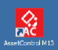

En esta primera ejecución el programa no está configurado y mostrará una pantalla
como la siguiente. Si el programa ya tiene una configuración anterior este paso se salta
y accede directamente a la pantalla de ingreso.

## Configurar cuenta del cliente:

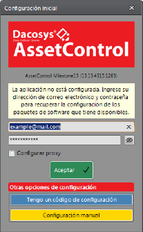

En esta pantalla debe ingresar las credenciales de cliente de Dacosys que son las
mismas que utilizó para descargar el instalador, y a continuación hacer clic en Aceptar.

## Selección del ambiente

El configurador le devolverá una lista de los paquetes y ambientes que el cliente tiene
pre-configurados en caso de que tenga más de un ambiente. En caso contrario se
configurará automáticamente:

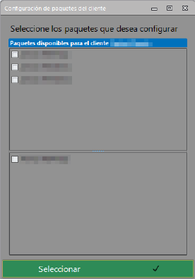

En esta pantalla debe seleccionar el ambiente y los paquetes de software que desea
utilizar en su instalación. Posteriormente, puede elegir otros para cambiar de ambiente.
Una vez seleccionado, hacer clic en Aceptar y se configurarán automáticamente las
conexiones al servidor del ambiente seleccionado.

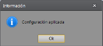

## Pantalla de ingreso:

A continuación el programa le mostrará la pantalla de ingreso:

Desde esta pantalla se puede acceder a la configuración del programa oprimiendo las
teclas Ctrl-E, y aparecerá en la esquina inferior derecha el botón Configuración.

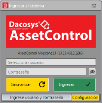

Los cambios de ambiente o de los datos de conexión solo pueden modificarse si se
accede a la configuración desde esta pantalla. Si el usuario ya ha ingresado al sistema,
estas opciones en particular no se pueden modificar.

El botón Sincronizar intentará crear una nueva conexión y descargar la base de datos si
es necesario. Normalmente, no es necesaria esta acción y solo se utiliza si inicialmente
el programa tuvo algún problema de conexión y hay que restablecerla.

## Pantalla de configuración

No es necesario ingresar a menos que tengamos que modificar los datos de
configuración o actualizar el programa.
La siguiente es una configuración de ejemplo y puede diferir de la que está viendo en su
instalación. Cuando se accede desde la pantalla de ingreso, algunas pestañas se verán
desactivadas, solo se pueden ver las pestañas: Acerca de, Servidor y Sincronización.

### Servidor

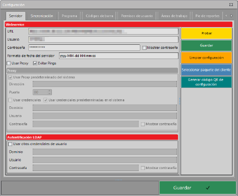

En la pestaña Servidor, además de modificar manualmente los datos de conexión, se
puede probar si los datos de conexión son correctos con el botón Probar.
Limpiar configuración elimina toda información de conexión y cliente y nos devuelve a la
pantalla de configuración del cliente (paso 4).
Seleccionar paquete del cliente, nos devuelve a la pantalla de selección de paquetes y
ambientes (paso 5).
Generar código QR de configuración, genera un código con la información de conexión
para configurar dispositivos u otros equipos.

### Sincronización

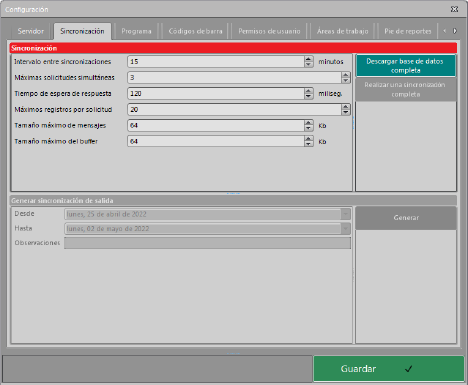

Aquí se presentan algunos datos de conexión que se pueden ajustar para mejorar el
rendimiento de las sincronizaciones.

### Acerca de

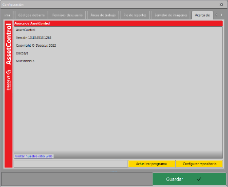

Desde esta pestaña se puede configurar los repositorios de software (ubicación de
descarga de los instaladores) y actualizar el software de manera sencilla.

### Configuración del repositorio

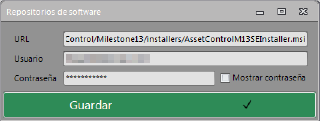

En esta pantalla se deben ingresar las mismas credenciales del cliente que se usaron
para descargar el instalador y configurar los ambientes. La URL no hace falta cambiarla.
Una vez configurados los repositorios puede actualizar el programa. Debe seleccionar el
destino de la descarga del nuevo instalador y el resto del proceso es casi automático.

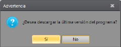

## Ingreso al sistema

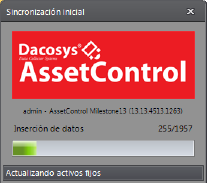

Una vez que está lista la configuración, el usuario u operador puede ingresar utilizando
su nombre de usuario y contraseña personal. Lo primero que el programa hará es
comprobar si existen nuevos datos en el servidor y los sincronizará.

## Pantalla principal

El programa está listo para usarse. En la barra superior aparece el nombre del usuario
actual, la versión de compilación del programa y el ambiente que está configurado.

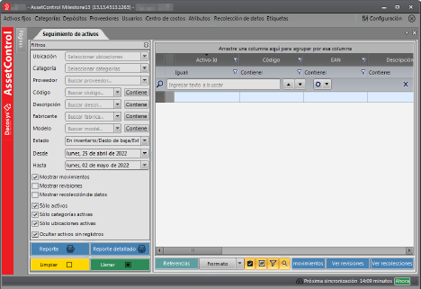