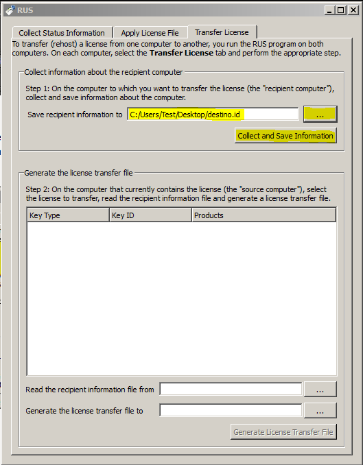
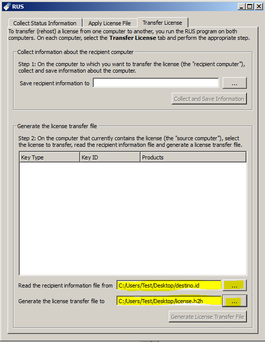
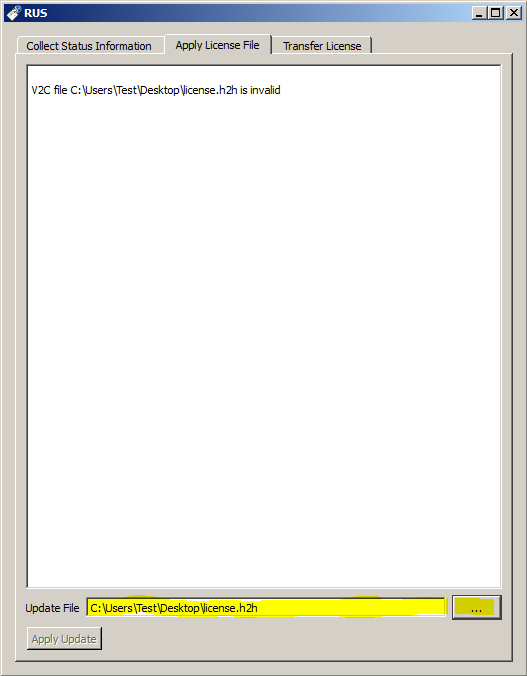

# Migrar licencia

## Definiciones

**_Origen_**: Equipo donde reside la licencia a migrar
**_Destino_**: Equipo que recibirá la licencia a migrar

### Observaciones

En la migración de licencias entre diferentes VMs puede ocurrir que al clonar una máquina o cuando la máquina ya tiene una licencia instalada este proceso no
sea satisfactorio sin antes realizar una limpieza total del sistema de licencias del _Destino_.

Para esto realizar los siguientes pasos adicionales en el equipo _Destino_ previo a la migración de las licencias.

1. correr el siguiente comando en una consola con permisos de administrador ```haspdinst.exe -fr```
2. Ejecutar ```_SSDCleanupx64.exe_```
3. Reiniciar el equipo de _Destino_
4. Ingresar en '_c:\program files\common files_' y en '_c:\program files x86\common files_' y borrar los directorios _Alladin_ y _Sentinel_
5. Instalar el driver de la licencia nuevamente
   ```haspdinst_new.exe -i```
6. Confirmar que no hay ninguna llave configurada localmente ingresando a [http://localhost:1947](http://localhost:1947)

## Proceso

Para migrar una licencia realizar los siguientes pasos:

1. Instalar el Software en la PC de _Destino_
2. Tanto en la PC de _origen_ como de _destino_ ejecutar el RUS (este programa puede ser encontrado dentro de la carpeta License del paquete de instalación)
3. En la PC de _Destino_ ir a la Pestaña "_Transfer license_" y dentro del grupo "_Collect information about the recipient computer_" presionar "..." para
   elegir una
   ubicación y destino del archivo de información del receptor. En este caso lo llamamos **_destino.id_**
   
4. Una vez seleccionado el nombre y ubicación del archivo presionar "_Collect and Save Information_".
5. Copiar el archivo destino.id a la PC de _Origen_
6. En la pc de _origen_ presionar "..." a la derecha de "Read the recipient information file from" y seleccione el archivo destino.id
7. En la pc de _origen_ presionar "..." a la derecha de "Generate the license transfer file to" y seleccione un nombre de archivo y ubicación. En este caso lo
   llamamos **_licencia.h2h_**   
   
8. Presione "_Generate license transfer file_"   
   
9. Copie el archivo _licencia.h2h_ a la PC de destino
10. En el _Destino_ ir a la pestaña "_Apply License File_" y usando el "_..._" a la derecha de "_Update File_" seleccionar el archivo **_licencia.h2h_**
11. Presionar "Apply update"
 
