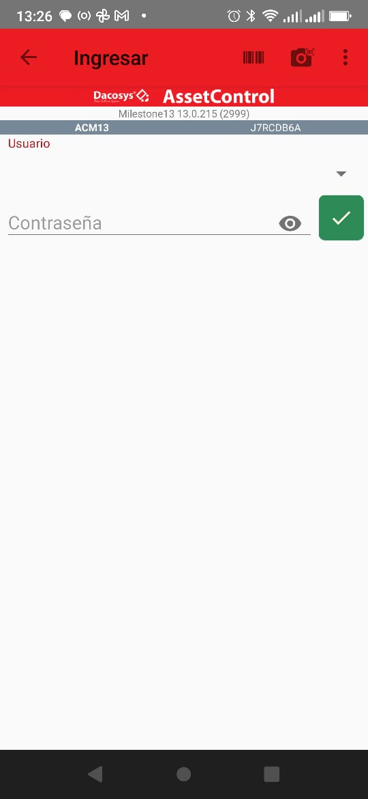
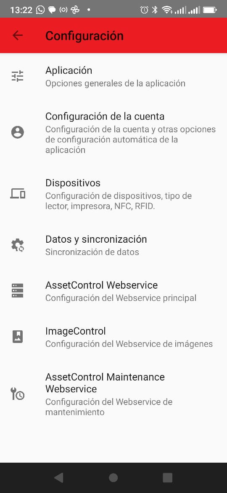
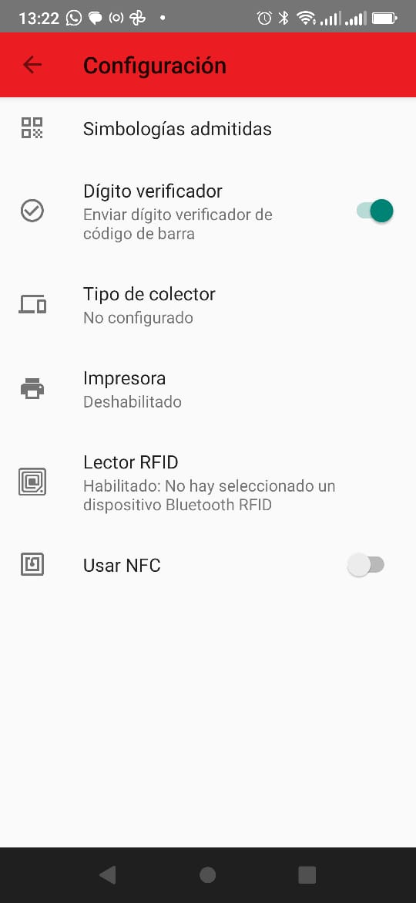
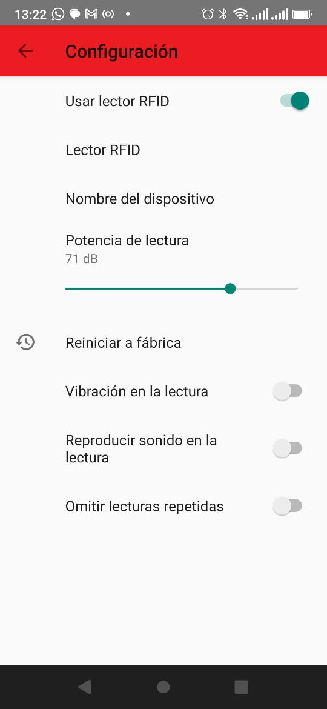

# Configuración lector RFID Bluetooth

## Descripción

El presente documento describe la forma de configurar un equipo RFID Vanch VH-75 para utilizarlo con el AssetControl

## Pasos

1. Asegurese que el equipo VH-75 esté conectado al Bluetooth del dispositivo Android!
2. Ingrese en configuración presionando los 3 puntos en el cuadrante superior derecho. Deberá ingresar la contraseña.

> 

3. En el menú principal de configuración presione en `Dispositivos`

> 

4. En el menú de dispositivos presione `RFID`

> 

5. En el menú `RFID`, active el mismo usando el Slide superior. Al hacerlo las opciones inferiores se podrán editar.

> 

6. Presione sobre `Nombre del dispositivo` e ingrese en nombre del _VH-75_ configurado en el punto 1. Por ejemplo '
   VH75-2'. Debe ser el mismo nombre que el definido en la configuración Bluetooth del equipo android.
7. Presione en `Lector RFID`. Debería poder ver ya la dirección del _VH-75_
8. Finalice volviendo al menú inicial.
9. Para verificar selecione `Reconectar equipo RFID`. Esta opción estará disponible en los `...` donde se accede a
   configuración.