# Recolección de datos en dispositivos móviles con Android

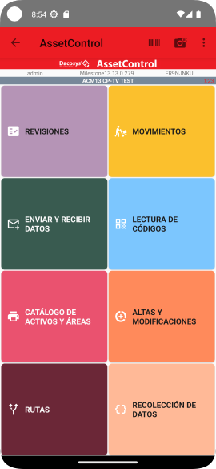

Para iniciar o continuar una recolección de datos debemos empezar seleccionando la ruta que vamos a recorrer haciendo
clic en el botón que dice `Rutas`.

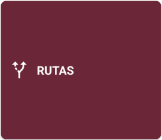

## Seleccionar la ruta

Esta pantalla nos muestra una lista de las rutas que el operario puede recorrer. En la parte inferior aparecen unos
controles que permiten filtrar los elementos visibles en la lista.

* Las rutas que tienen una recorrida ya iniciada se muestran en fondo Azul y la leyenda `Iniciada` al seleccionarse.
* Las rutas que tienen una recorrida completada lista para enviarse se muestran en fondo Amarillo y la leyenda
  `Por enviar` al ser seleccionadas.
* El resto, todavía sin recorridas iniciadas, se muestran en fondo Blanco y la leyenda `No iniciada` al seleccionarse.

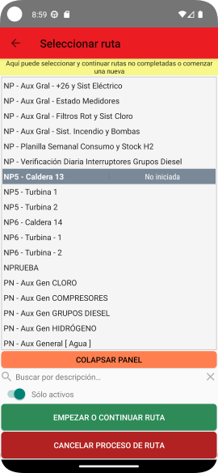

Desde esta pantalla se puede iniciar o continuar una recorrida, seleccionando la ruta a recorrer y haciendo clic en el
botón `Empezar o continuar ruta`.

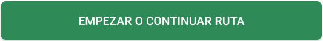

## Iniciar la recorrida

Al iniciar o continuar una recorrida guardada, lo que vemos es una lista de las unidades técnicas (UT) de las que
debemos recopilar información. El orden de la lista no es obligatorio y el operario puede seleccionar cualquier UT
pendiente de recopilación y procesarla.

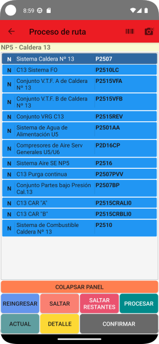Mor

* En Amarillo se muestran las UT `Omitidas` con la leyenda **O**.
* Las UT `No procesadas` en fondo Celeste y con la leyenda **N**.
* Las UT `Procesadas` en fondo Verde y con la leyenda **P**.

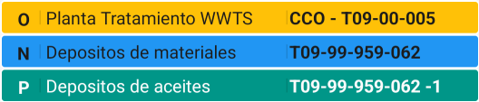

Para iniciar la carga de datos de UT, debemos seleccionarla en la lista tocando sobre ella y hacer clic en el botón
`Procesar`.

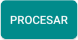

Si la unidad ya fue procesada y es necesario volver a procesarla debemos tocar el botón `Reingresar`, a continuación
cambiará su estado a **N** y podremos volver a procesarla.

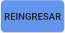

Si una UT necesita ser omitida de la carga, la seleccionamos en la lista y hacemos clic en el botón `Saltar`.

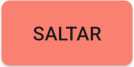

Para omitir todas las UT pendientes de registro debemos hacer clic en `Saltar restantes`, esto cambiará el estado de
todas las UT que aún no fueron procesadas a **O**.

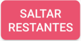

## Recolección de datos

La pantalla de carga de datos se muestra distinta información relacionada con la UT y a los parámetros que debemos
cargar.

En la parte superior se muestra el código y la descripción de la UT.

A la derecha en la parte superior se muestra la cantidad de pasos que componen esa captura de datos y en qué paso
estamos en este momento.

En la parte inferior, en un panel colapsable, se muestran los últimos 4 registros de información capturada en esa unidad
técnica con la fecha en que fueron hechas esas cargas.

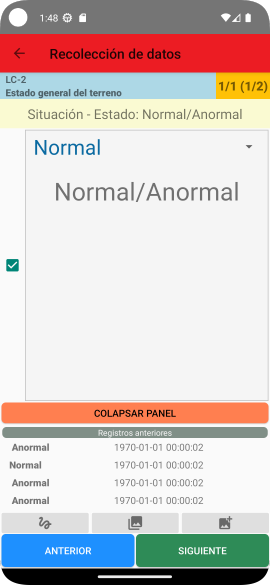

El tipo de control que se muestra en esta pantalla depende del tipo de dato que estamos cargando. Pueden mostrarse
controles desplegables con opciones seleccionables, controles para ingresar valores numéricos, de texto, fechas, etc.

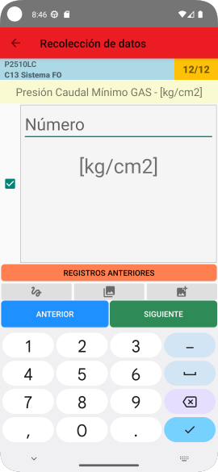

Podemos desplazarnos entre los atributos con los botones `Anterior` y `Siguiente` que se muestran
en la parte inferior de la pantalla.

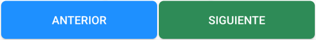

### Captura de imágenes

Desde la pantalla de carga de datos también podemos cargar imágenes si está configurado el módulo **ImageControl**.
Cuando
el módulo está configurado la pantalla nos mostrará una serie de botones.

| 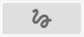       | Permite agregar una firma.                                    |
|-----------------------------------------------------------------------|---------------------------------------------------------------|
| 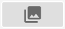 | Permite ver las imágenes agregadas.                           |
| 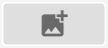     | Permite agregar imágenes desde la cámara o el almacenamiento. |

Para capturar o cargar una imagen relacionada con la UT que estamos procesando debemos hacer clic en el botón para
agregar imágenes de la barra de **ImageControl**.

Esto nos llevará a una pantalla desde donde podremos tomar fotos o
subir imágenes ya almacenadas.

La aplicación puede solicitar permisos al operador para poder tomar fotografías y explorar las carpetas de imágenes del
dispositivo.

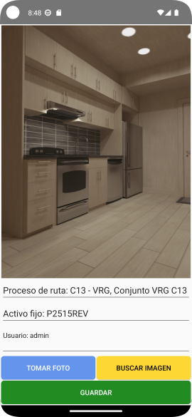

La información que se muestra es completada automáticamente por la aplicación con información de la ruta, la UT y el
nombre del usuario que está haciendo la recorrida. Cualquiera de esos campos es editable y puede agregarse información
de ser necesario, ya que corresponden a los campos `Descripción`, `Referencia` y `Observaciones` respectivamente.

Para terminar hacer clic en `Guardar`.

De vuelta en la pantalla de carga de datos podemos ver una galería con las imágenes cargadas haciendo clic en el segundo
botón de la barra inferior.

El símbolo que aparece en la esquina superior derecha muestra si la imagen está pendiente de
envío o es una imagen proveniente del servidor.

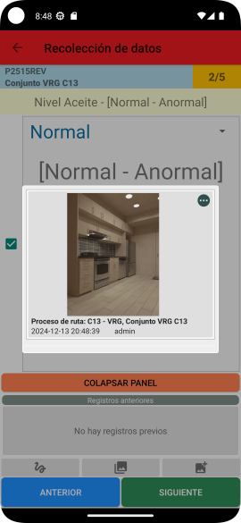

### Opciones adicionales

En la pantalla de procesamiento de UT podemos consultar detalles de la UT con el botón `Detalle`.
También podemos consultar los datos recientemente cargados para esa UT con el botón `Actual`.

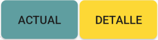

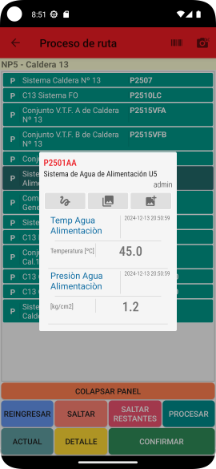
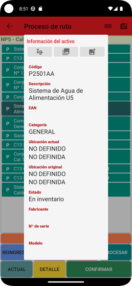

Podemos ver las imágenes relacionadas con esa UT y agregar nuevas a través de la barra de botones de **ImageControl**.

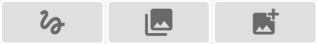

## Confirmar recorrida

Cuando una recorrida ya no tiene UT sin procesar, se habilitará el botón `Confirmar` cambiando de color Gris a color
Verde. Al hacer clic se cerrará la recorrida, quedará lista para enviarse y volveremos a la pantalla de selección de
rutas.

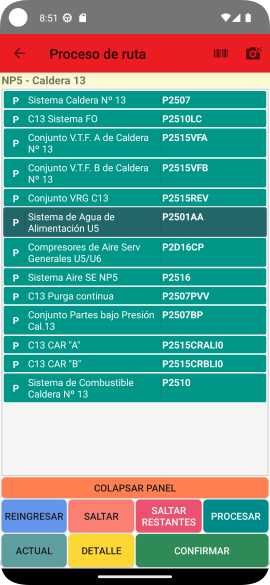

De vuelta en la pantalla de selección de rutas, veremos las rutas procesadas con fondo Amarillo y al seleccionarla
aparece la leyenda `Por enviar`.

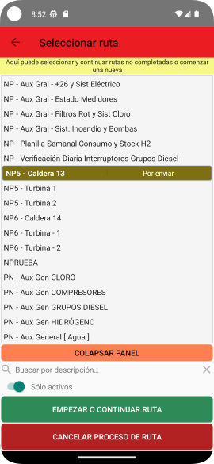

## Enviar los datos recopilados

Para enviar la información recolectada debemos hacer clic en el botón `Enviar y recibir datos` de la pantalla principal.

Eso nos llevará una pantalla donde se muestran los diferentes tipos de datos que el dispositivo tiene pendiente de
envío. El tipo de elementos visibles en esta pantalla se puede definir haciendo clic en el ícono de la parte superior de
la pantalla.

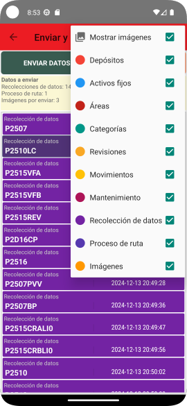

Para enviar los datos debemos hacer clic en el botón `Enviar datos`.

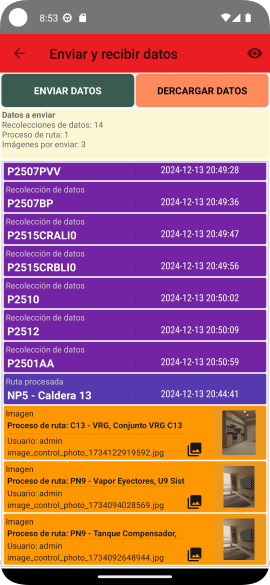

Cuando el envío de datos finalice la lista deberá aparecer vacía.

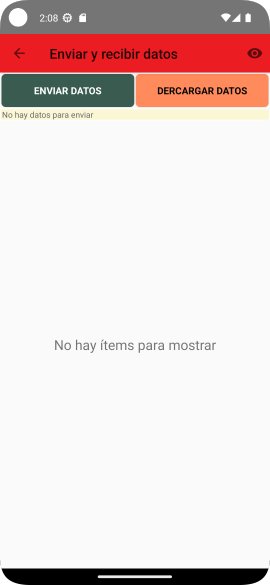