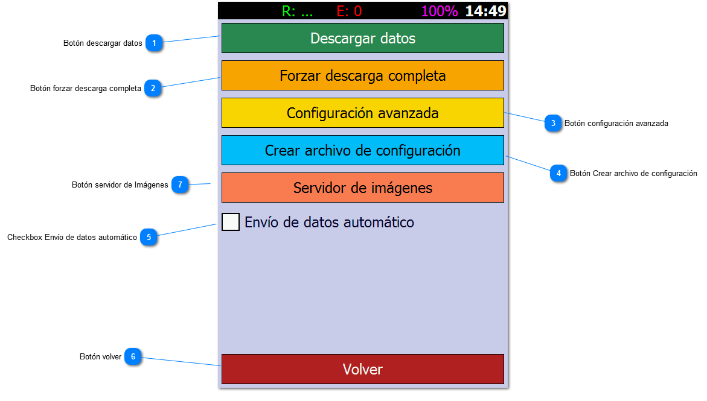

# Configuración

1. Botón descargar datos: Accede a la pantalla de descarga de datos del servidor.

2. Botón forzar descarga completa: Ingresa en la opción Descargar datos, pero obliga al sistema a descargar todos los
   datos nuevamente.

3. Botón configuración avanzada: Accede a la configuración avanzada del software

4. Botón Crear archivo de configuración: Genera un archivo TXT en el directorio del programa que permite reconfigurar el
   equipo con solo leer este código 2D

5. Checkbox Envío de datos automático: Si este cuadro se encuentra tildado luego de cada operación se dará la opción de
   enviar la información directamente.

6. Botón volver: Retorna a la pantalla de ingreso o al menú principal

7. Botón servidor de Imágenes: Permite la configuración del ImageControl en caso de poseer un servidor del mismo. Este
   se utiliza para tomar imágenes de los
   activos y/o firmas de los procesos.