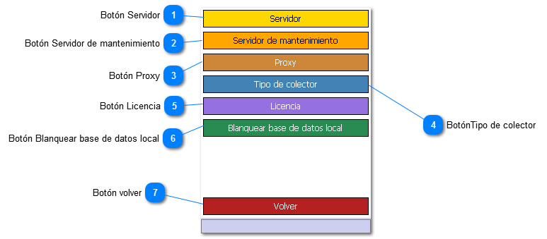

# Configuración Avanzada

1. Botón Servidor:
   Accede a la pantalla de configuración para la conexión con el servidor de activos fijos

2. Botón Servidor de mantenimiento
   Accede a la pantalla de configuración para la conexión con el servidor de mantenimiento

3. Botón Proxy
   Acceso a la configuración de proxy usada para acceder el servidor de activos y el servidor de mantenimiento

4. BotónTipo de colector
   Accede al menu de selección de modelo de colector.

5. Botón Licencia
   Accede a la pantalla de ingreso de licencia

6. Botón Blanquear base de datos local
   Borra toda la información que existe en la base de datos del colector. Se debe realizar una descarga completa luego
   de realizar esta operación.

7. Botón volver
   Cierra la ventana y retorna a la ventana de configuración