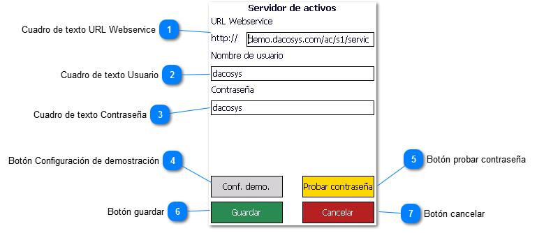

# Configuración servidor de activos fijos

1. Cuadro de texto URL Webservice: Ingrese aquí la dirección de su servidor Web sobre el cual está montado el
   webservice.

2. Cuadro de texto Usuario: Ingrese aquí el nombre de usuario de seguridad para acceso al webservice. Si la opción de
   seguridad está desactivada puede obviar este punto.

3. Cuadro de texto Contraseña: Ingrese aquí la contraseña de seguridad para acceso al webservice. Si la opción de
   seguridad está desactivada puede obviar este punto.

4. Botón Configuración de demostración: Llena el formulario con la configuración del servidor de demostración del
   software

5. Botón probar contraseña: Prueba la conexión y contraseña de seguridad

6. Botón guardar: Guarda los cambios realizados

7. Botón cancelar: Sale de la pantalla sin guardar ningún cambio