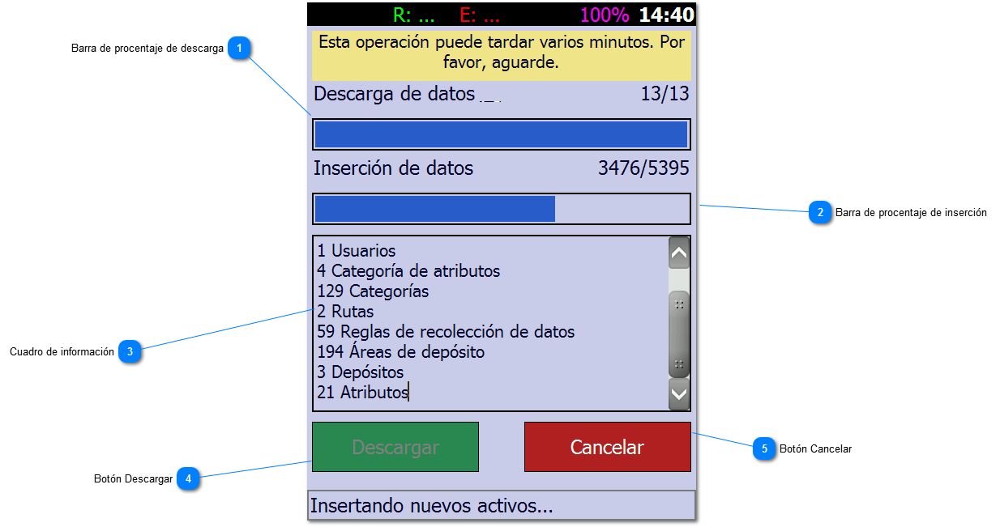

# Descargar Datos

Esta pantalla, la cual es accesible desde diferentes partes del programa, permite conectarnos con el servidor para
descargar las actualizaciones que se
encuentren disponibles. En caso de existir datos para enviar el sistema nos obligará a realizar primero esa operación.

1. Barra de porcentaje de descarga

2. Barra de porcentaje de inserción:

3. Cuadro de información: Aquí verá la información del avance de la descarga

4. Botón Descargar: Inicia el proceso de descarga.

5. Botón Cancelar: Cierra la ventana y nos devuelve a la ventana anterior