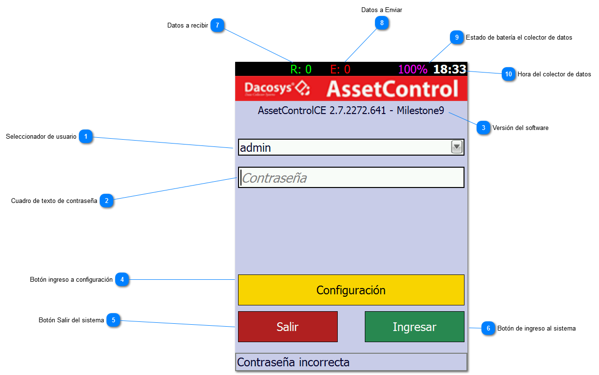
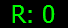
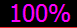
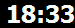

# Pantalla de Ingreso

Esta es la pantalla que verá al iniciar la aplicación.

En caso de que el software no este configurado el sistema lo llevará automáticamente a configuración para poder hacerlo.
Esto mismo ocurre si existen datos nuevos para descargar.

1. Seleccionador de usuario
   Seleccione aquí el usuario creado en el software de escritorio.

2. Cuadro de texto de contraseña
   Ingrese aquí la contraseña configurada en el software de escritorio.

3. **Versión del software**
   La versión del software aparece en el cuadrante superior derecho de la pantalla de login. La misma puede ser
   requerida por el soporte técnico.

4. Botón de ingreso a configuración
   Ingreso al sector de configuración del software

5. Botón Salir del sistema

6. Botón de ingreso al sistema

7. 

   **Datos a recibir**
   El número representa la cantidad de datos nuevos a recibir disponibles en el servidor.

8. 

   **Datos a Enviar**
   El número representa las recolecciones, movimientos o tomas de estado que aún no han sido enviadas al colector.

9. 

   **Estado de batería**

10. 

    **Hora del colector de datos**
    Esta es la hora del colector de datos, la cual puede tener una diferencia con la del servidor. Dependiendo del tipo
    de implementación la hora del colector puede actualizarse automáticamente.
