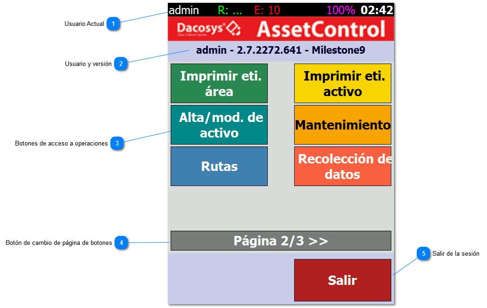

# Menú Principal

Estos botones nos permiten acceder a diferentes operaciones y consultas. Los botones disponibles y su distribución
dependen de los permisos que tenga cada
usuario.

1. Usuario Actual: Usuario autentificado en el sistema

2. Usuario y versión

3. Botones de acceso a operaciones: Estos botones nos permiten acceder a diferentes operaciones y consultas. Los botones
   disponibles y su distribución dependen
   de los permisos que tenga cada usuario.

4. Botón de cambio de página de botones: Un usuario puede tener acceso a más de 6 operaciones. En caso de ser así
   presionando este botón el usuario podrá
   acceder al siguiente grupo de operaciones. En este caso se muestra que hay 3 grupos de opciones.

5. Salir de la sesión: Este botón nos devuelve a la pantalla de Ingreso