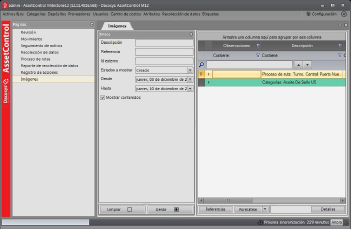

# Módulo de imágenes

**ImageControl en Windows**

## Imágenes capturadas

Las imágenes capturadas en diferentes procesos, una vez que el servidor terminó de
procesarlas, se pueden consultar seleccionando la página Imágenes en la pantalla
principal del programa.

También pueden consultarse las imágenes relacionadas en otras pantallas específicas,
como por ejemplo Procesos de ruta, en las opciones del menú desplegable.

Al hacer doble clic sobre la fila deseada se abrirá una ventana con la imagen en tamaño
completo.