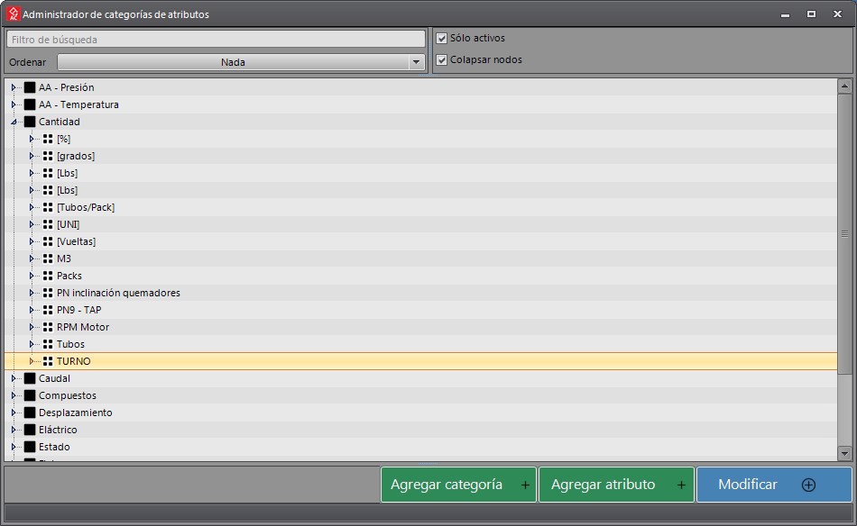

# Creación y edición de rutas para recolección de datos

Para crear o editar rutas para recolección de datos debemos hacer clic en las opciones `Recolección de datos` -> `Rutas`
en el menú principal.

## Seleccionar ruta

En esta pantalla podemos seleccionar una ruta creada para modificarla o crear una nueva.

Del lado izquierdo de la pantalla tenemos controles para filtrar las rutas que se ven en la lista de la derecha.
Para que estos filtros se apliquen debemos hacer una nueva consulta a la base de datos haciendo clic en el botón
`Llenar`.

La lista puede filtrarse utilizando las celdas superiores de cada columna. El ícono del filtro en color Amarillo indica
que la lista tiene un filtro activo y que es posible que no se estén mostrando todos los elementos.

Podemos hacer clic sobre el ícono y cambiar el tipo de filtrado o quitarlo.

Para modificar una ruta existente debemos seleccionarla y hacer clic en el botón `Modificar` que se muestra en la parte
inferior.
Para crear una nueva ruta desde cero debemos hacer clic en el botón `Agregar ruta`.

Al hacer clic sobre alguno de estos botones se mostrará un panel donde podemos editar las propiedades de la ruta o crear
una nueva.

## Creación de rutas

En esta pantalla veremos la lista de unidades técnicas (UT) que componen la recorrida o una lista vacía en caso de estar
creando una nueva ruta.
Las celdas con fondo gris indican que el valor que se está mostrando es editable por el usuario. Cada UT está en una
`Posición` determinada dentro de un `Nivel`, y tiene definida una `Regla` que contiene el conjunto de datos que el
operario va a registrar en esa UT.

La posición de las UT puede cambiarse utilizando los controles que se muestran a la derecha. Este es el orden en que el
operario verá la recorrida en la pantalla del dispositivo móvil.

|  | * Las flechas dobles mueven las UT entre niveles. * Las flechas simples mueven las UT de posición dentro de un mismo nivel. * Para crear un nuevo nivel, seleccionamos la UT y la movemos con la doble flecha hacia abajo. |
|---------------------------------|------------------------------------------------------------------------------------------------------------------------------------------------------------------------------------------------------------------------------------|

Para guardar los cambios que realicemos en la ruta debemos hacer clic en el botón `Guardar` que aparece abajo. Podemos
hacer una copia de la ruta con `Guardar como nuevo`.

Para agregar una UT debemos hacer clic en botón que dice `Activo +`.

Esto nos mostrará una pantalla desde donde seleccionar las UT. Esta pantalla tiene una serie de controles en el lado
izquierdo para filtrar la información mostrada en la lista. Además, la lista también puede filtrarse a través de las
cabeceras de cada columna. Al seleccionar la UT, esta se agregará a la recorrida de la ruta.

Volviendo a la pantalla de la recorrida debemos seleccionar la regla que se aplicará a la UT. Para esto debemos
seleccionar la UT en la lista, hacer clic en `Regla +` y se nos mostrará un selector de reglas ya creadas.

También puede seleccionar la regla desde una lista desplegable directamente desde la celda de la regla.

Si la regla no existe y necesitamos crearla, debemos hacer clic en `Administrador de reglas`.

## Creación de reglas

En esta pantalla podemos crear nuevas reglas o editar reglas existentes.

Haciendo clic en los botones `Modificar` o `Agregar` se abrirá un panel y nos mostrará una lista de los atributos que
deben registrarse en las UT que usen esta regla o una lista vacía si estamos creando una regla nueva. El operario
ingresará la información en el orden aquí definido.

El orden de los atributos puede modificarse con los botones a la derecha de la lista.
Para crear un nuevo nivel primero agregar el atributo y luego moverlo a un nivel superior con la "Doble flecha hacia
abajo", esto creará un nuevo nivel con el atributo seleccionado.

|  | * Las flechas dobles mueven los atributos entre niveles. * Las flechas simples mueven los atributos de posición dentro de un mismo nivel. * Para crear un nuevo nivel, seleccionamos el atributo y lo movemos con la doble flecha hacia abajo. |
|-------------------------------------|--------------------------------------------------------------------------------------------------------------------------------------------------------------------------------------------------------------------------------------------------------|

Para agregar un atributo ya existente debemos hacer clic en `Atributo +`.

Esto nos mostrará un selector de atributos.

Para crear un nuevo atributo debemos hacer clic en `Administrador de atributos`.

## Creación de atributos

En esta pantalla podemos crear o modificar los atributos y sus componentes haciendo clic en los botones `Modificar` y
`Agregar atributo` que aparecen en la parte inferior.

El editor de atributos nos muestra la composición del atributo seleccionado. El `Tipo` de atributo puede seleccionarse
mediante un menú desplegable que aparece al hacer clic sobre el valor presente. En el caso de la imagen, el tipo de
datos seleccionado es `Opciones (separadas por ;)` y se mostrará al operario del dispositivo móvil cómo un selector
desplegable con las opciones definidas en el campo `Opciones (separadas por ;)` como `1;2;3;4`, donde el punto y
coma (;) delimita cada opción seleccionable por el operario. Los campos `Descripción` y `Nombre` se mostrarán al
operario en las pantallas de toma de datos.

Un atributo puede tener una composición múltiple, agregando nuevos componentes con el botón `Agregar +`. Cada uno
ocupará una `Composición` del atributo. En el caso de la imagen, el atributo está compuesto por `Opciones` y un
`Número decimal`. También podemos definir su `Valor predeterminado` y la opción de `Sólo lectura`.

## Editor de expresiones

Podemos definir múltiples caminos en la recorrida dependiendo de la información registrada. Es necesario crear
expresiones que definan las condiciones y los caminos a tomar. Para esto debemos hacer clic en el botón `...` que
aparece en la celda correspondiente.
En el ejemplo de la imagen podemos ver que la ruta tiene 4 niveles. Los niveles solo son accesibles al operario cuando
se cumplen las condiciones de la fórmula.

El editor de expresiones tiene en la parte superior un campo donde se muestra la fórmula que estamos creando. Debajo
aparecen los botones para agregar los operadores válidos.
A la derecha aparece un botón Azul para hacer la evaluación de la fórmula `!`, al lado otro Amarillo para mostrar un
panel con una explicación la sintaxis de las fórmulas `?`. Debajo de estos hay un panel que mostrará el resultado de la
última evaluación.

Para seleccionar una UT que queremos agregar la fórmula, debemos hacer doble clic sobre ella en la lista de abajo. Esto
insertará un texto en la fórmula que contiene el nivel, la posición y la UT que estamos evaluando.
Mediante diferentes operadores lógicos podemos comparar el valor registrado en esa UT y desviar el recorrido hacia otro
nivel.
Podemos cambiar el valor que aparece en la columna `Valor de ejemplo` para evaluar el resultado de la fórmula con el
botón `!` de color Azul. El resultado de esta operación aparecerá en el recuadro inferior.

En la fórmula mostrada, se compara el valor registrado en un *Sistema de combustible*. Los valores comparados en las
`Opciones (separadas por ;)` son su valor de texto. La fórmula indica que si la opción seleccionada es "FO" el
operario deberá registrar las UT del Nivel `2`, si se selecciona "GAS" se registrarán las UT del Nivel `3` y si
selecciona una tercera opción (En este caso "MEZCLA") el operario registrará la información de las UT de nivel `4`.

* Los números positivos son interpretados como saltos a esos niveles.
* `0` (Cero) equivale a la orden `Continuar`, es decir que el recorrido continúa con la siguiente UT del recorrido.
* `-1` equivale a la orden `Volver` que interrumpe el recorrido del nivel y regresa al nivel de donde proviene.
* `-2` equivale a la orden `Fin` que finaliza el recorrido.
* `-3` equivale a la orden `No continuar` que no permite proseguir con ese valor registrado.
* Secuencia de números positivos separados por comas (",") dentro de comillas simples (') para ejecutar niveles en forma
  consecutiva.

Para que la regla se aplique, al regresar a la lista de UT, debe seleccionarse en la columna `Verdadero` y `Falso` la
opción `Nivel X` que determina que el paso siguiente está determinado por en el resultado de la fórmula.

## ¿Cómo se refleja la información en el dispositivo móvil?

La información de la recorrida está compuesta de datos de la ruta, de las UT, de las reglas y de los atributos que
estamos midiendo. Esta información que fuimos suministrando aparecerán en distintas partes de la pantalla del
dispositivo móvil cuando el operario esté realizando la recorrida.

Tomemos como ejemplo la siguiente ruta.

|          |          | * La `Descripción` de la ruta aparece en el texto superior. * Lista de UT en el mismo orden, mostrando la `Descripción` y el `Código` de la UT.                                                                                                                                                                                                                                                |
|---------------------------------|-------------------------------------------------|----------------------------------------------------------------------------------------------------------------------------------------------------------------------------------------------------------------------------------------------------------------------------------------------------------------------------------------------------------------------------------------------------|
|            |            | * El `Código` y la `Descripción` de la UT aparece en fondo Celeste. * La posición que se está registrando dentro del total de pasos de la regla en fondo Amarillo. * La `Descripción` del paso seguida de la `Descripción` del atributo. * La opción seleccionada es el `Valor predeterminado` del atributo. * El texto en color Gris corresponde a la `Descripción` del atributo. |
|  |  | * Las `Opciones` se muestran en forma de lista desplegable. * El `Tipo` de atributo determina el tipo de dato que necesitamos registrar y por lo tanto el tipo de control que se mostrará. * Si `Sólo lectura` fuese verdadero, el control se vería transparentado y no se podría modificar el valor mostrado.                                                                              |