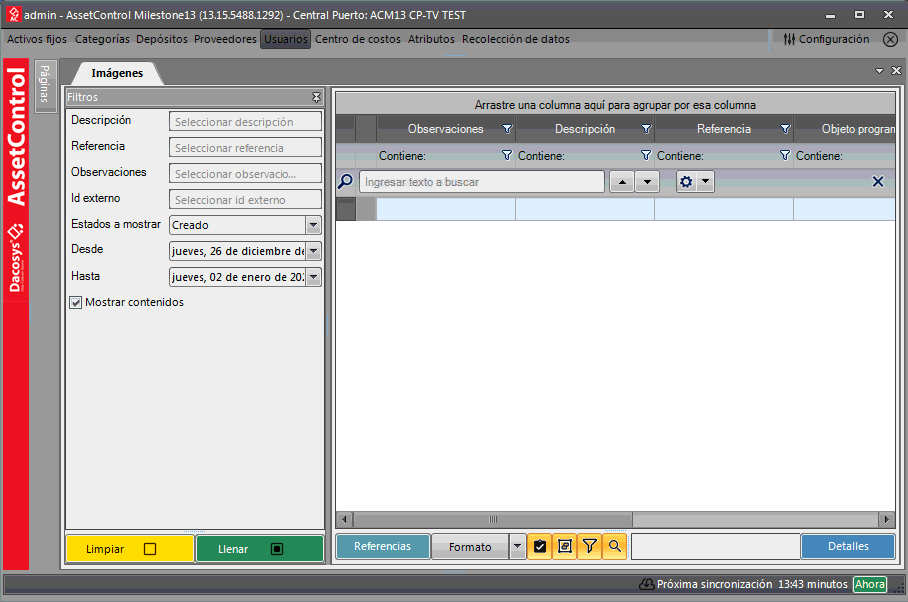
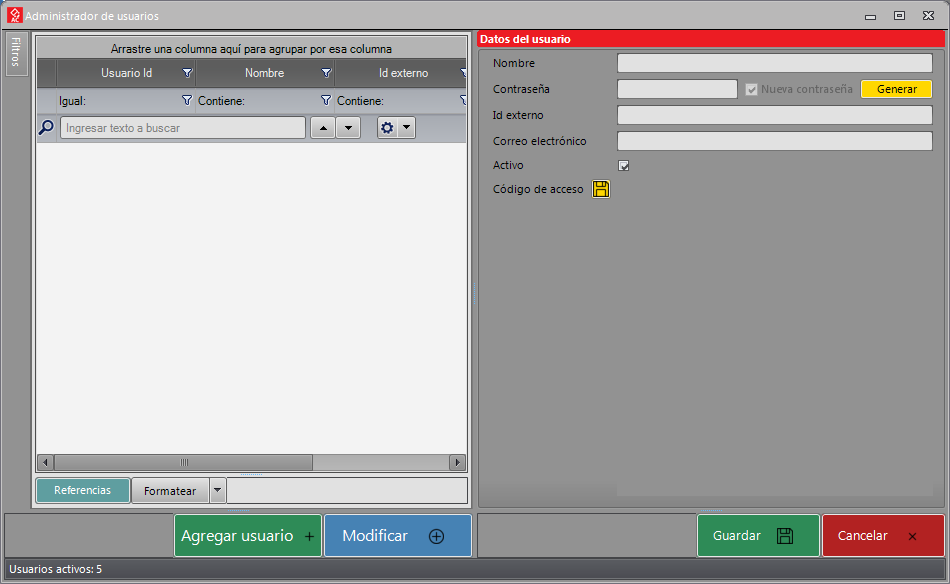
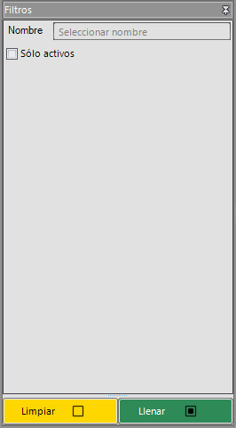
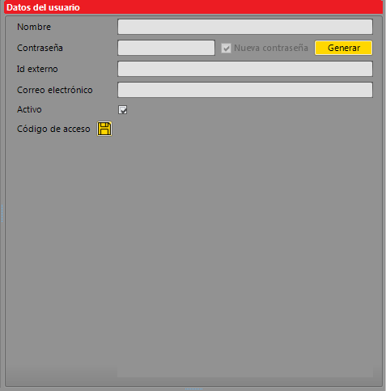
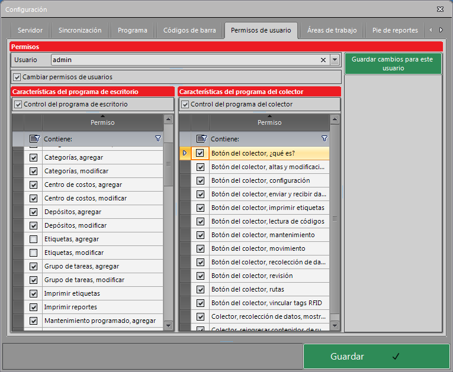
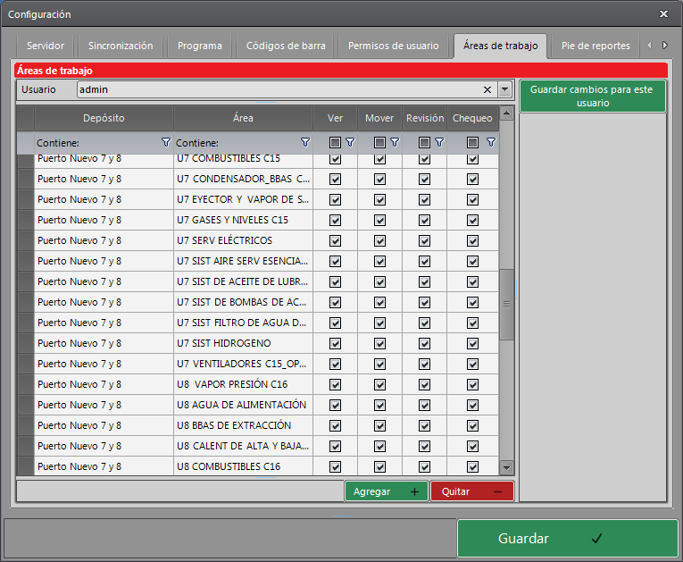
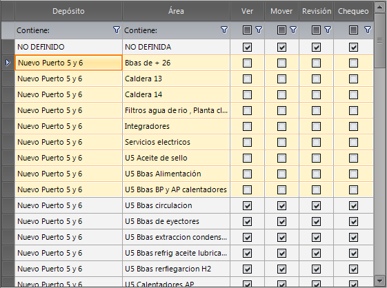
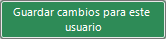

# Creación y edición de usuarios

Para crear o editar usuarios hay que hacer clic en la opción `Usuarios`
en el menú principal.

## Seleccionar usuario

En esta pantalla podemos seleccionar un usuario de la lista para modificarlo o crear uno nuevo.

Del lado izquierdo de la pantalla tenemos controles para filtrar los usuarios que se ven en la lista de la derecha.
Para que estos filtros se apliquen debemos hacer una nueva consulta a la base de datos haciendo clic en el botón
`Llenar`.

Para modificar un usuario existente debemos seleccionarlo y hacer clic en el botón `Modificar` que se muestra en la
parte inferior. Para crear un nuevo usuario desde cero debemos hacer clic en el botón `Agregar usuario`.

Al hacer clic sobre alguno de estos botones se mostrará un panel donde podemos editar las propiedades del usuario o
crear uno nuevo.

## Creación/Modificación de usuarios

En este panel podemos cambiar las propiedades principales del usuario y **generarle una clave al azar**.

Para guardar los cambios que realicemos en el usuario debemos hacer clic en el botón `Guardar` que aparece abajo.

## Permisos del usuario

Para dar permisos a un usuario ir a la `Configuración` en el menú principal del programa y a la pestaña
`Permisos de usuarios`.

Seleccionar el usuario deseado en la lista desplegable y se llenarán la lista inferior con los permisos que ese usuario
posee. La lista de la izquierda tiene los permisos para la aplicación de Escritorio y la lista de la derecha los
permisos para aplicación móvil (Windows CE o Android). Las casillas marcadas definen que el permiso está otorgado. Se
pueden seleccionar múltiples filas y marcarlas todas con la tecla `SPACE` y desmarcarlas con `BACKSPACE`.

Al finalizar hacer clic en el botón `Guardar cambios para este usuario`.

## Áreas del usuario

Para asignar las áreas visibles a un usuario ir a la `Configuración` en el menú principal del programa y a la pestaña
`Áreas de trabajo`.

Seleccionar el usuario deseado en la lista desplegable y se llenarán la lista inferior con las áreas del sistema
marcadas las casillas según las tareas que el usuario puede realizar.

Se pueden marcar todas las casillas con `Ctrl+A` y luego apretando `SPACE` o desmarcar con `BACKSPACE`.

Al finalizar hacer clic en el botón `Guardar cambios para este usuario`.