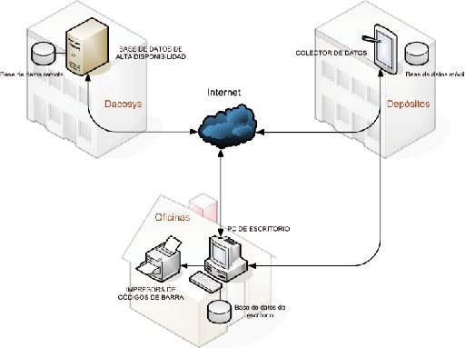
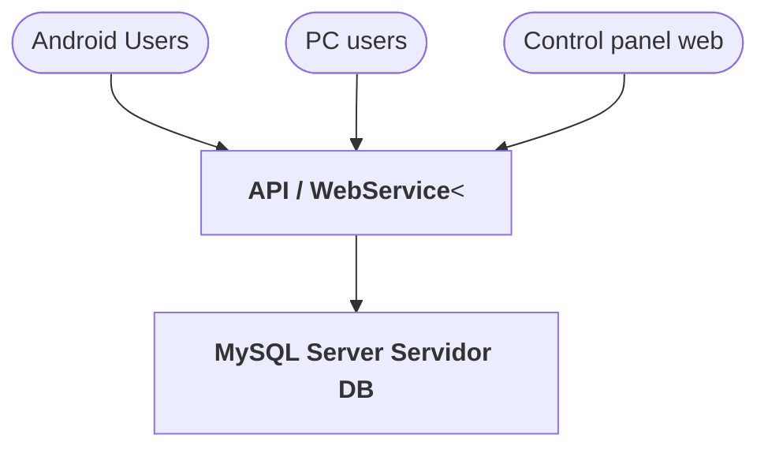

# Modelo Tecnológico

## Descripción

El Sistema AssetControl de Dacosys® (Anexo II) es un sistema de control activos y obtención de datos sobre estos.
Su principal objetivo es adicionar la utilización de colectores de datos al sistema instalado por el cliente.
Su implementación normalmente requiere de ciertas modificaciones para lograr el objetivo deseado.
El mismo tiene un diseño centralizado, soportado en una arquitectura de software Cliente-Servidor implementado en un
Webservice/API a ser ubicado en una locación del ente
controlador (Oficinas de control) o bien soportado sobre servidores propios de Dacosys® y accedido luego remotamente.

Los equipos de cómputo 'Clientes' son los colectores de datos que poseen los inspectores y el 'Servidor' es el
computador con el que se conectan los colectores para registrar la entrada y salida de materiales.

La conexión de estos con el servidor puede hacerse por medio de Internet o red local (normalmente WIFI).
Los clientes pueden tener el aplicativo instalado en ellos o bien conectarse por Terminal Service a un servidor donde este instalado.
Las conexiones con permisos de acceso elevado pueden ser protegidas por medio de un sistema de llaves físicas de seguridad y autenticación de usuario. Las
conexiones de
bajo nivel son solo protegidas por medio de autenticación de usuario.

## Gráfica

