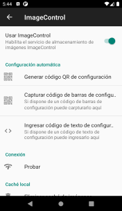
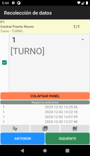
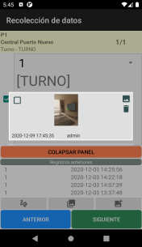
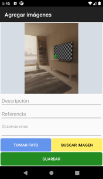

# Módulo de imágenes ImageControl para dispositivos móviles con Android

El módulo de imágenes ImageControl se configura automáticamente cuando se selecciona el entorno de trabajo deseado la
primera vez que se inicia el programa
AssetControl, sin embargo, si se necesitan hacer cambios en esta configuración se puede acceder de diferentes formas
dependiendo del dispositivo que estemos
utilizando.

## Configuración

Desde esta pantalla se pueden cambiar los datos de conexión al webservice de ImageControl y habilitar esta funcionalidad
en las distintas partes del programa.
También se puede generar un código QR con esta información para ser escaneada en otro dispositivo y copiar la
configuración.

## Opciones disponibles con Image control configurado

En la imagen de la izquierda se puede ver los botones específicos de ImageControl que solo son visibles si está
habilitado el servicio desde la configuración.
Estos botones representan: *Firmar, Ver imágenes y Agregar imágenes*.

## Ver imágenes

Al hacer clic en *Ver imágenes*, el programa buscará las imágenes relacionadas con el ítem sobre el que estamos
trabajando. En el caso del ejemplo se buscarán
las imágenes relacionadas con el activo **P1**. Si existiesen imágenes, el programa las mostrará en una nueva pantalla.

## Agregar imágenes

Al hacer clic en Agregar imágenes, se abrirá una ventana desde donde podemos tomar fotografías con la cámara del
dispositivo (Tomar foto) o buscar imágenes ya
existentes en el almacenamiento del dispositivo
*(Buscar imagen)*.
También se puede agregar textos adicionales en los campos *Descripción, Referencia y Observaciones*.
Para confirmar los cambios se debe hacer clic en Guardar.
Las imágenes serán enviadas en el mismo momento en que se realice la sincronización para subir datos recolectados.
En el caso de las imágenes agregadas a activos, categorías o ubicaciones en las pantallas de Altas/Modificación, estas
se enviarán automáticamente si existe
conexión al servidor en el momento de guardar los cambios.

 